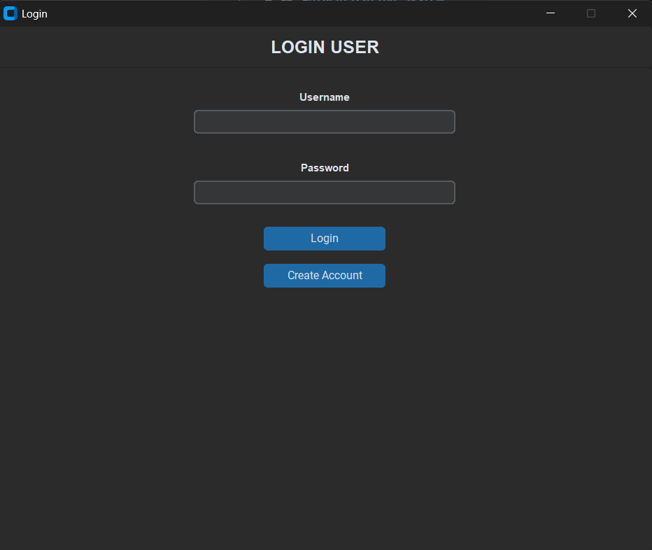
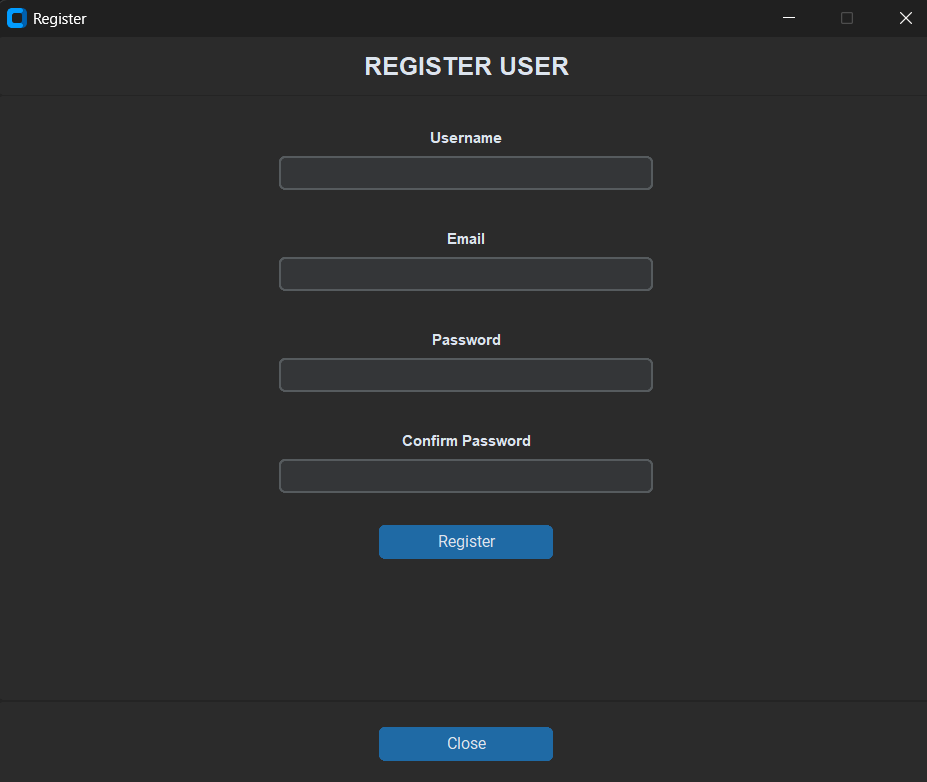
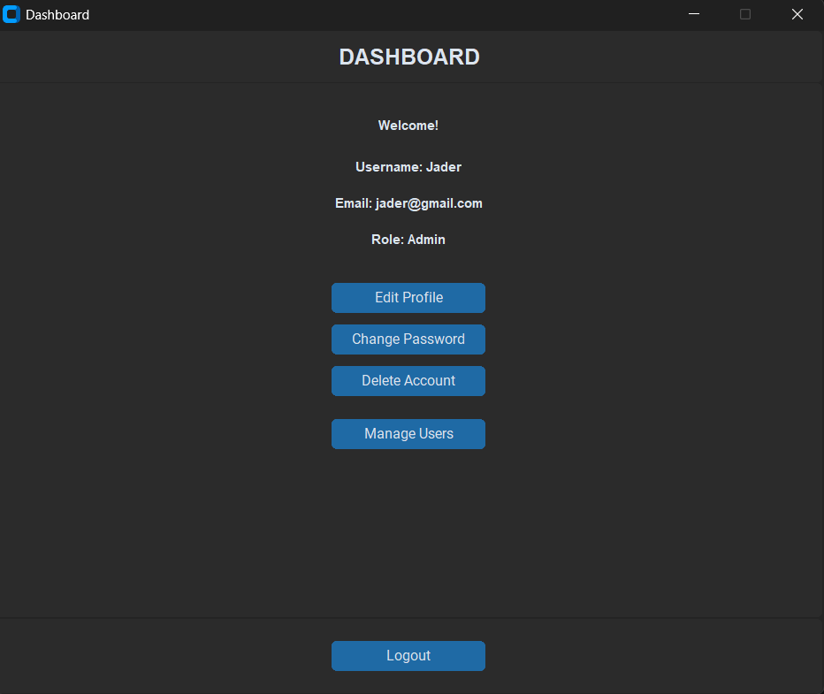
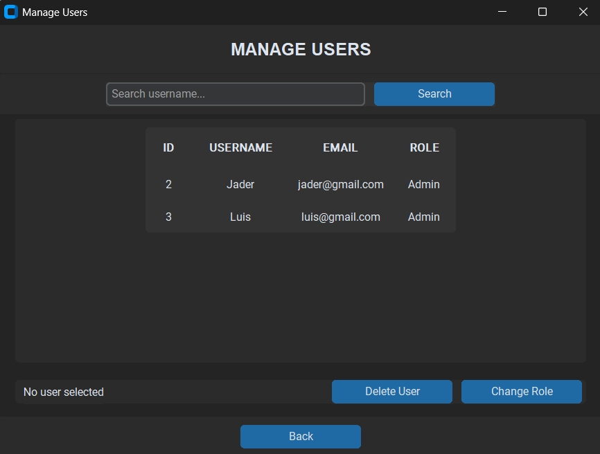
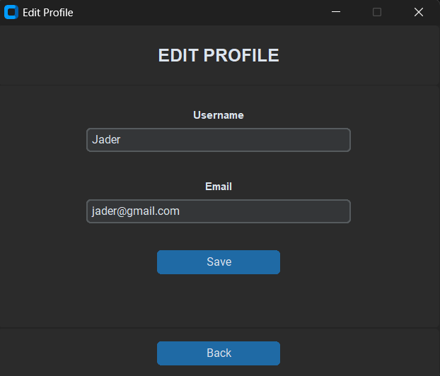
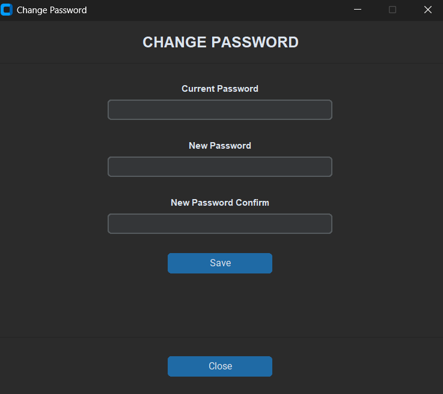
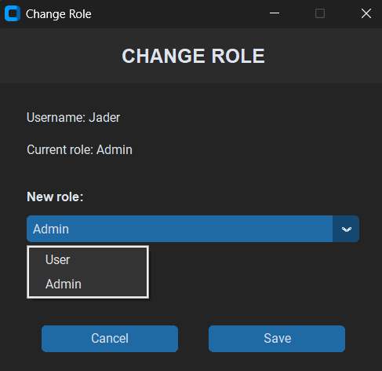

# 🔐 Authentication System

A desktop authentication and user management application built with
**Python**, **CustomTkinter**, **SQLite**, and **bcrypt**.

This project was created as a practical software engineering project to
learn how authentication, database operations, password security, GUI
architecture, CRUD operations, and role-based functionality work
together in a real application.

------------------------------------------------------------------------

## 📌 Overview

The Authentication System provides a complete desktop workflow for
registering and authenticating users.

After logging in, users can manage their own account information, while
administrators have additional permissions to manage other users and
their roles.

The application uses:

-   **CustomTkinter** for the graphical user interface
-   **SQLite** for persistent data storage
-   **bcrypt** for secure password hashing
-   A separated **GUI** structure to keep interface code and
    application logic organized

------------------------------------------------------------------------

## ✨ Features

### 🔑 Authentication

-   User registration
-   User login
-   Password hashing with bcrypt
-   Password verification with bcrypt
-   Empty-field validation
-   Password confirmation during registration
-   Username uniqueness validation
-   Email uniqueness validation
-   Invalid email validation
-   Wrong-password handling
-   User-not-found handling

### 👤 Profile Management

Authenticated users can:

-   View their username
-   View their email
-   View their role
-   Edit username
-   Edit email
-   Change password
-   Delete their account
-   Log out

### 🛡️ Role-Based Access

The system currently supports two roles:

-   **User**
-   **Admin**

Administrators have access to the user management functionality.

### 👥 User Management

Administrators can:

-   View registered users
-   Search users by username
-   Select a user
-   Change a user's role
-   Delete a user

### 🖥️ GUI

The application includes separate windows for:

-   Login
-   Registration
-   Dashboard
-   Edit Profile
-   Change Password
-   Manage Users
-   Change Role
-   Delete User

The interface is built with **CustomTkinter**.

------------------------------------------------------------------------

## 🛠️ Technologies

  Technology      Purpose
  --------------- -----------------------------------
  Python          Main programming language
  CustomTkinter   Desktop graphical interface
  SQLite          Local relational database
  bcrypt          Password hashing and verification
  Git             Version control
  GitHub          Source-code hosting

------------------------------------------------------------------------

## 🏗️ Project Architecture

The project separates the graphical interface from application/database
logic.

``` text
AuthenticationSystem/
│
├── assets/
│
├── database/
│   └── users.db
│
├── gui/
│   ├── login.py
│   ├── register.py
│   ├── dashboard.py
│   ├── edit_profile.py
│   ├── changepass.py
│   ├── manage_users.py
│   ├── ChangeRole.py
│   └── delete_user.py
│
├── services/
│   ├── __init__.py
│   ├── auth.py
│   └── database.py
│
├── main.py
├── requirements.txt
├── .gitignore
└── README.md
```

### `gui/`

Contains the application's graphical interface and individual windows.

### `services/`

Contains the application's core logic:

-   `auth.py` handles authentication and user-related business logic.
-   `database.py` handles SQLite connections and SQL operations.

### `database/`

Contains the SQLite database used by the application.

### `main.py`

Starts the application and initializes the database/table before opening
the login window.

------------------------------------------------------------------------

## 🔄 Application Flow

The main user flow is:

``` text
                    ┌─────────────┐
                    │    Start    │
                    └──────┬──────┘
                           │
                           ▼
                    ┌─────────────┐
                    │    Login    │
                    └──────┬──────┘
                           │
              ┌────────────┴────────────┐
              │                         │
              ▼                         ▼
        ┌───────────┐             ┌────────────┐
        │ Register  │             │Authenticate│
        └─────┬─────┘             └──────┬─────┘
              │                           │
              └─────────────┐             │
                            ▼             ▼
                         ┌──────────────────┐
                         │    Dashboard     │
                         └────────┬─────────┘
                                  │
                 ┌────────────────┼─────────────────┐
                 │                │                 │
                 ▼                ▼                 ▼
           Edit Profile    Change Password    Delete Account
                                  │
                                  │
                         ┌────────▼────────┐
                         │   Admin Role?   │
                         └────────┬────────┘
                                  │ Yes
                                  ▼
                         ┌─────────────────┐
                         │  Manage Users   │
                         └────────┬────────┘
                                  │
                       ┌──────────┼──────────┐
                       ▼          ▼          ▼
                   Search User  Change Role  Delete User
```

------------------------------------------------------------------------

## 🔒 Security

Passwords are **not stored as plain text**.

During registration, the password is converted into bytes and hashed
using bcrypt before being stored in the database.

During login, bcrypt verifies the entered password against the stored
hash.

Conceptually:

``` text
User password
      │
      ▼
   bcrypt
      │
      ▼
Password hash
      │
      ▼
   SQLite
```

The application also uses parameterized SQL queries such as:

``` python
cursor.execute(
    "SELECT id FROM users WHERE username = ?",
    (username,)
)
```

This helps protect database queries from SQL injection.

> **Important:** This project is an educational/portfolio application.
> It should not be considered production-ready authentication software
> without additional security hardening, testing, deployment controls,
> and security review.

------------------------------------------------------------------------

## 🚀 Installation

### 1. Clone the repository

``` bash
git clone https://github.com/jader-ruiz/Authentication-System.git
cd AuthenticationSystem
```

Replace `https://github.com/jader-ruiz/Authentication-System.git` with the URL of your GitHub
repository.

### 2. Create a virtual environment

Windows:

``` bash
python -m venv venv
```

### 3. Activate the virtual environment

Windows Command Prompt:

``` bash
venv\Scripts\activate
```

Windows PowerShell:

``` powershell
venv\Scripts\Activate.ps1
```

### 4. Install dependencies

``` bash
pip install -r requirements.txt
```

### 5. Run the application

``` bash
python main.py
```

------------------------------------------------------------------------

## 📦 Dependencies

The project currently uses:

-   `bcrypt`
-   `customtkinter`

The exact versions are defined in `requirements.txt`.

------------------------------------------------------------------------

## 🗄️ Database

The application uses SQLite and stores user information in:

``` text
database/users.db
```

The users table contains information such as:

``` text
id
username
email
password
role
```

Roles are currently:

``` text
User
Admin
```

The application uses parameterized SQL statements for database
operations including:

-   `SELECT`
-   `INSERT`
-   `UPDATE`
-   `DELETE`

------------------------------------------------------------------------

## 🧪 Example Workflow

### Register

A new user provides:

``` text
Username
Email
Password
Confirm Password
```

The application validates the information, hashes the password, and
creates the account.

### Login

The user enters:

``` text
Username
Password
```

The system retrieves the user and verifies the password using bcrypt.

### Dashboard

After successful authentication, the user can see:

``` text
Username
Email
Role
```

and access the available account actions.

### Admin

If the authenticated user has the `Admin` role, the application provides
access to:

``` text
Manage Users
```

where administrators can search for users, select a user, change their
role, or delete the account.

------------------------------------------------------------------------

## 🧠 What I Learned

This project helped me practice several important software engineering
concepts.

### Python

-   Functions
-   Classes
-   Object-oriented programming
-   Modules and packages
-   Imports
-   Dictionaries and tuples
-   Virtual environments

### GUI Development

-   CustomTkinter
-   Frames
-   Labels
-   Buttons
-   Entries
-   Option menus
-   Grid and Pack geometry managers
-   Multiple windows with `CTkToplevel`
-   Window communication
-   Showing and hiding windows
-   Event callbacks

### Databases

-   SQLite
-   Connections and cursors
-   `SELECT`
-   `INSERT`
-   `UPDATE`
-   `DELETE`
-   `WHERE`
-   Primary keys
-   Unique constraints
-   Parameterized SQL queries
-   CRUD operations

### Authentication

-   Registration flow
-   Login flow
-   Password hashing
-   Password verification
-   Validation
-   User sessions/data passing between windows
-   Role-based functionality

### Software Engineering

-   Separating GUI and business logic
-   Organizing a project into packages
-   Reusing functions
-   Managing dependencies
-   Using Git and GitHub
-   Building a project incrementally
-   Debugging real application errors

------------------------------------------------------------------------

## 📸 Screenshots











------------------------------------------------------------------------

## 🎯 Project Goal

The goal of this project was to move beyond simple tutorial applications
and build a complete desktop application that combines:

``` text
Python
   +
GUI
   +
Database
   +
Authentication
   +
Security
   +
CRUD
   +
Roles
```

The project was developed as a hands-on learning experience in software
engineering and Python development.

------------------------------------------------------------------------

## 👨‍💻 Author

**Jader Ruiz**

System Engineering Student \| Python & Software Engineering Learner

This project is part of my software engineering portfolio and represents
my practical work with Python, databases, authentication, GUI
development, and application architecture.

------------------------------------------------------------------------
